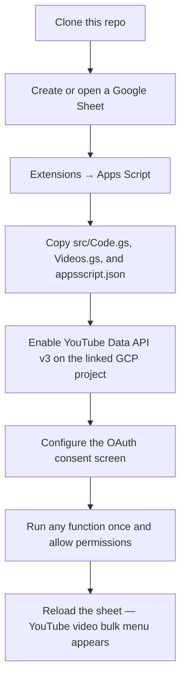
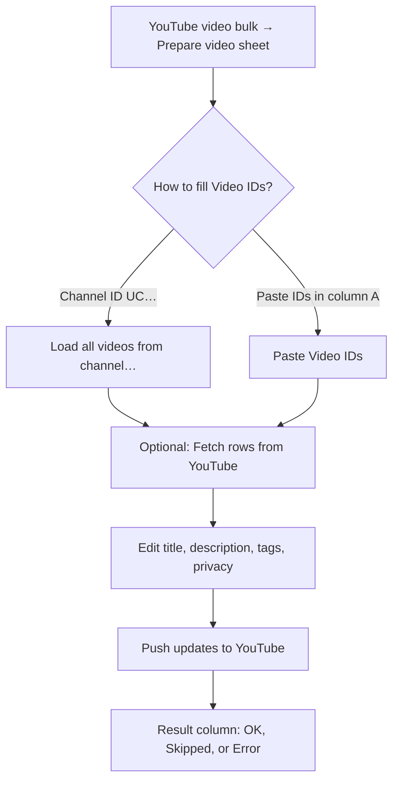

# YouTube Bulk Update

Edit YouTube video metadata in a Google Sheet and sync changes with the **YouTube Data API v3**. Copy the Apps Script files from `src/` into a spreadsheet-bound script.

## What it does

- **Prepare video sheet** — Writes column headers on the active tab.
- **Load all videos from channel…** — Given a channel ID (`UC…`), lists every video in that channel’s uploads playlist and fills the sheet.
- **Fetch rows from YouTube (pull)** — For each row with a Video ID, refreshes title, description, tags, category, privacy, and “made for kids” from the API.
- **Push updates to YouTube** — Writes your sheet values back to YouTube. **Blank cells** mean “do not change this field on YouTube.”

### Sheet columns (row 1)

| Video ID | Title | Description | Tags | Category ID | Privacy | Made for kids | Result |

- **Tags:** comma-separated.
- **Privacy:** `public`, `unlisted`, or `private`.
- **Made for kids:** `TRUE` or `FALSE` (also accepts common yes/no style on push).
- **Result:** filled by the script (`OK`, `Error: …`, `Skipped`, etc.).

## Prerequisites

- A Google account that **owns or can manage** the YouTube channel whose videos you edit.
- [Google Cloud](https://console.cloud.google.com/) access to enable **YouTube Data API v3** on the project linked to your Apps Script.

## Setup

```bash
git clone https://github.com/KushalAzza/youtube-bulk-update.git
cd youtube-bulk-update
```



1. Create or open a Google Sheet.
2. **Extensions → Apps Script**.
3. Copy these files into the script project (same names):
   - `src/Code.gs`
   - `src/Videos.gs`
   - `src/appsscript.json` (Project Settings → show `appsscript.json`, or replace the manifest)
4. Save the project.

The manifest enables the **YouTube advanced service** and these OAuth scopes:

- `https://www.googleapis.com/auth/youtube.force-ssl`
- `https://www.googleapis.com/auth/spreadsheets.currentonly`

In the Apps Script editor, confirm **Services** includes **YouTube Data API v3** (the `YouTube` advanced service).

## Enable YouTube Data API v3

1. In the Sheet: **Extensions → Apps Script → Project settings**.
2. Under **Google Cloud Platform (GCP) Project**, note or open the linked project.
3. In [Google Cloud Console](https://console.cloud.google.com/) for **that** project: **APIs & Services → Library →** enable **YouTube Data API v3**.

Without this, API calls from the script will fail.

## OAuth consent screen

Still in the **same** GCP project: **APIs & Services → OAuth consent screen**.

1. Choose **User type** (**Internal** for a single Workspace org; **External** if you need accounts outside that org).
2. If the app is in **Testing**, add every Google account that will use the spreadsheet under **Test users**.
3. If you see **`403 org_internal`**, the signing-in account is not allowed for how the app is configured.

Save changes before authorizing the script.

## Authorize the script (each spreadsheet user, once)

1. Reload the Google Sheet (so **YouTube video bulk** menu appears).
2. **Extensions → Apps Script** → select a function such as **`fetchVideoRowsFromYouTube`** or **`prepareVideosSheet`** → **Run**.
3. Click **Review permissions** and complete **all** steps. For unverified apps, use **Advanced → Go to … (unsafe)** if shown.
4. Wait until the run **finishes** (green check).

Anyone who uses the menu on that spreadsheet must complete this once with **their** Google login.

OAuth uses a **Google account**. That account must be able to manage the channel in YouTube Studio. If **Push** returns **Forbidden**, the authorized account usually does not manage that video’s channel.

## Day-to-day workflow



1. On a tab, run **YouTube video bulk → Prepare video sheet** (once per tab you use for videos).
2. Either **Load all videos from channel…** (enter `UC…`) or paste **Video IDs** in column A.
3. **Fetch rows from YouTube (pull)** if you need fresh data from the API.
4. Edit cells (only non-blank cells are sent on push).
5. **Push updates to YouTube** for the selected rows, or all data rows if nothing is selected below the header.

**Row selection:** If your selection starts **below row 1**, only those rows are processed; otherwise all rows from row 2 through the last row are processed.

## Quota (YouTube Data API v3)

Default daily quota is often **10,000 units** (resets midnight Pacific). Approximate costs:

| Action | Per row / per call |
|--------|---------------------|
| **Push** | `videos.list` (**1**) + `videos.update` (**50**) ≈ **51 units per row** |
| **Fetch (pull)** | **1 unit** per row (`videos.list`) |
| **Load all from channel** (N videos) | `channels.list` (1) + `playlistItems.list` (⌈N/50⌉) + `videos.list` batches (⌈N/50⌉) — relatively cheap vs bulk push |

Example: pushing **200** rows ≈ **10,200 units** — can exceed one day’s default in a single run. Spread pushes across days or request a quota increase in Cloud Console.

## Troubleshooting

| Symptom | What to check |
|--------|----------------|
| Menu missing | Reload the sheet; ensure `onOpen` ran; try **Extensions → Apps Script** and run any function once. |
| “Requires access to your Google Account” | Finish OAuth in the script editor (**Run** → **Review permissions** → allow everything). |
| **Forbidden** on push | Use the Google account that **manages** that channel; share the Sheet with that account; re-authorize. |
| **Quota exceeded** | Reduce batch size; wait for reset; request higher quota. |
| `org_internal` | OAuth consent: Internal vs External, test users, correct GCP project. |

## Project layout

```
youtube-bulk-update/
  LICENSE
  README.md
  src/
    appsscript.json   # scopes, V8, YouTube advanced service
    Code.gs           # menu, helpers, error formatting
    Videos.gs         # load / fetch / push video logic
```

## References

- [Apps Script YouTube advanced service](https://developers.google.com/apps-script/advanced/youtube)
- [YouTube Data API v3](https://developers.google.com/youtube/v3)
- [Quota costs](https://developers.google.com/youtube/v3/determine_quota_cost)

## License

MIT. See [LICENSE](LICENSE).
